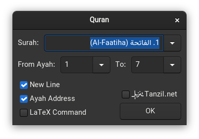

# gedit-quran

This plugin facilitates the accurate typesetting of Holy Quran verses within the gedit text editor.

## Installation

### Option 1: Quick Install

Run the following command in your terminal:

```sh
make install
```

### Option 2: Manual Installation

Download the ZIP file and move the extracted files to your `gedit` plugin directory (usually located at `~/.local/share/gedit/plugins/`), or clone the repository using Git:

```sh
mkdir -p ~/.local/share/gedit/plugins
git clone https://github.com/javadr/gedit-quran.git
cp -rfv gedit-quran/src/* ~/.local/share/gedit/plugins
```

## Usage

After restarting Gedit and activating the plugin from the preferences dialog,
you can seamlessly access it in two ways:

1. **Via Tools Menu:**
   Navigate to the `Tools` menu, where you'll find the plugin conveniently listed.
   Click on `Quran...` to start using the features.

2. **Shortcut Key:**
   Use the shortcut `<Alt> + q` to quickly access the plugin without navigating through menus.

Enjoy typesetting Quranic verses in your `gedit` editor!

<p align="center"></p>
<p align="center"></p>

## Options

The `gedit-quran` plugin offers several customization options to tailor your experience:

1. **Ayah Number:** Appends the Ayah number to the end of each Ayah.

2. **NewLine Character:** Typesets each Ayah on a separate line for improved readability.

3. **LaTeX Integration:** Utilize the `LaTeX` command to incorporate the `LaTeX` macro, in conjunction with the [quran](https://github.com/javadr/quran) LaTeX package.


## Contributing

Feel free to contribute by opening issues or submitting pull requests.
We welcome your feedback!
